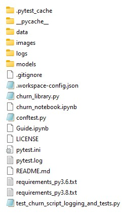
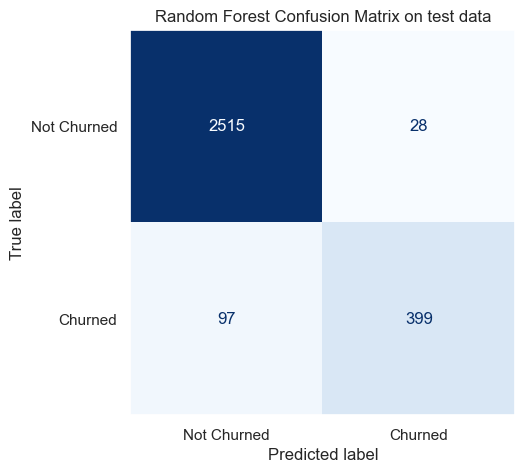
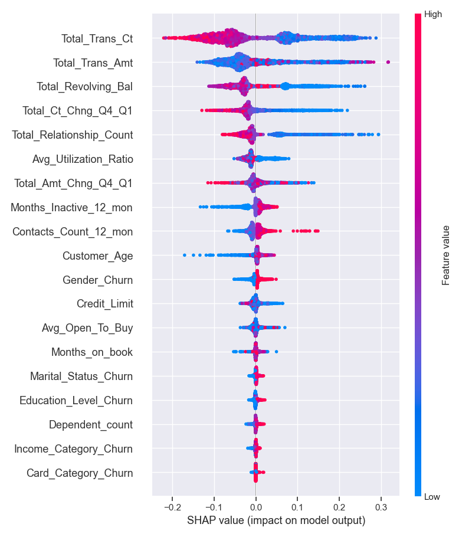

# Predict Customer Churn

- Project **Predict Customer Churn** of ML DevOps Engineer Nanodegree Udacity

## Project Description
This is the first project of Udacity's Machine Learning DevOps Engineer Nanodegree.
The project objective is to produce production-ready clean code using best practices.
The project itself aims at predicting customer churn for banking customers. This is a classification problem.
The project proposes the following approach:
- Load and explore the dataset composed of over 10k samples (EDA)
- Prepare data for training (feature engineering resulting into 19 features)
- Train two classification models (sklearn random forest and logistic regression)
- Identify most important features influencing the predictions and visualize their impact using SHAP library
- Save best models with their performance metrics

## Files and data description
#### Overview of the files and data present in the root directory
The project is organized with the following directory architecture:
- Folders
    - Data      
        - eda       --> contains output of the data exploration
        - results   --> contains the dataset in csv format
    - images        --> contains model scores, confusion matrix, ROC curve
    - models        --> contains saved models in .pkl format
    - logs          --> log generated druing testing of library.py file

- project files 
    - churn_library.py
    - churn_notebook.ipnyb
    - requirements.txt

- pytest files (unit test file and configuration files)
    - test_churn_script_logging_and_tests.py  
    - pytest.ini    
    - conftest.py

## Running Files
- The project should be executed with python 3.8 and the appropriate python packages
- The required packages are provided in the requirements.txt file
- To run the project, execute the script `python churn_library.py` from the project folder
- Alternatively, the project can be executed using the jupyter notebook for a step-by-step approach
- The project script `churn_library.py` was tested using pytest python package
    - To run the unit tests, simply type `pytest` from the main project folder in the command line
    - Project functions will be automatically tested with log file generated in the logs folder

## Classification performance

Random Forest achieves the best performance on the test set:

The influence of each feature on the prediction to churn can be visualized using SHAP module:

